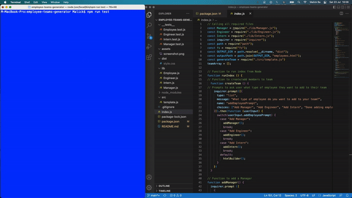
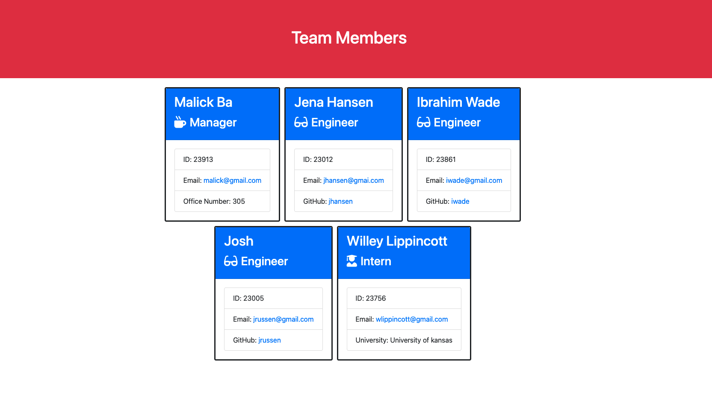

# Employee Teams Generator

## Description
This application was built to generate profiles based on inputs from **Node.js Inquirer** Module. The information entered by the user is displayed on a generated HTML file. I built this application using Test Driven Development process, which led to multiple iterations as I had to create various test cases for the various functions to operate as expected. The application demonstrates the capabilities of **Jest** and **Object Oriented Progamming (OOP)** when building everyday-use applications.

## Table of Contents
- [Description](#description)
- [User Story](#user-story)
- [Installation](#installation)
- [Usage](#usage)
- [Walkthough Video](#walkthough-video)
- [Screenshot](#screenshot-of-HTML-output)
- [Contributors](#contributors)

## User Story
As a Manager, I want to generate a webpage that displays my team's basic info so that I have quick access to their emails and GitHub profiles.
I need a command line input program so that...
- When I am prompted for my team members and their information, an HTML file is generated that displays a nicely formatted team roster based on user input.When I click on an email address in the HTML, my default email program opens and populates the TO field of the email with the address.
- When I click on the GitHub username, that GitHub profile opens in a new tab.
- When I start the application, I am prompted to enter the team manager’s name, employee ID, email address, and office number.
- When I enter the team manager’s name, employee ID, email address, and office number, I am presented with a menu with the option to add an engineer or an intern or to finish building my team.
- When I select the engineer option, I am prompted to enter the engineer’s name, ID, email, and GitHub username, and I am taken back to the menu.
- When I select the intern option, I am prompted to enter the intern’s name, ID, email, and school, and I am taken back to the menu.
- When I decide to finish building my team, I exit the application, and the HTML is generated.

## Installation 
Please clone repostitort from GitHub and install NPM Inquirer package. Please install Jest for testing.

## Usage
- Use `npn run test` from the command line to run the test. Then, use `node index` to launch the application. Follow the prompts. HTLM out put will be generated under the "dist" folder and will be named "employees.html". The file can be opened in any browser and will be rendered as an HTML webpage.

## Walkthough Video
- A full walkthough video can be found at the following URL: https://drive.google.com/file/d/1qCRzH67in6UcpwodvprcBouH71TKkxuZ/view?usp=sharing

## Screenshot of HTML Output
The following image shows the generated HTML’s appearance and functionality:

## Contributors
Malick Ba, Software Engineer

## More Information
Author: **Malick Ba**, Software Engineer based in Virginia, USA

For more projects, please visit my [GitHub page](https://github.com/malickbax)
